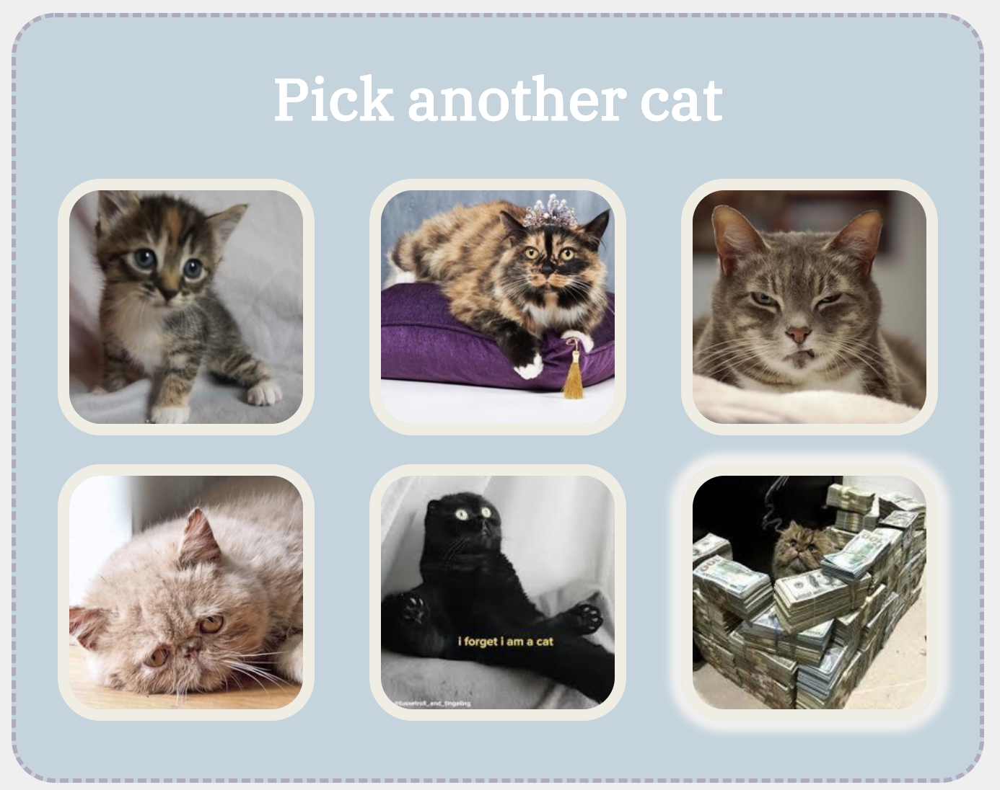
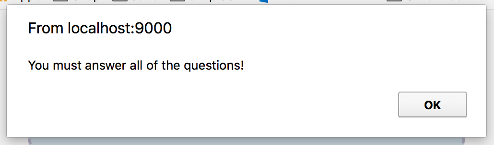
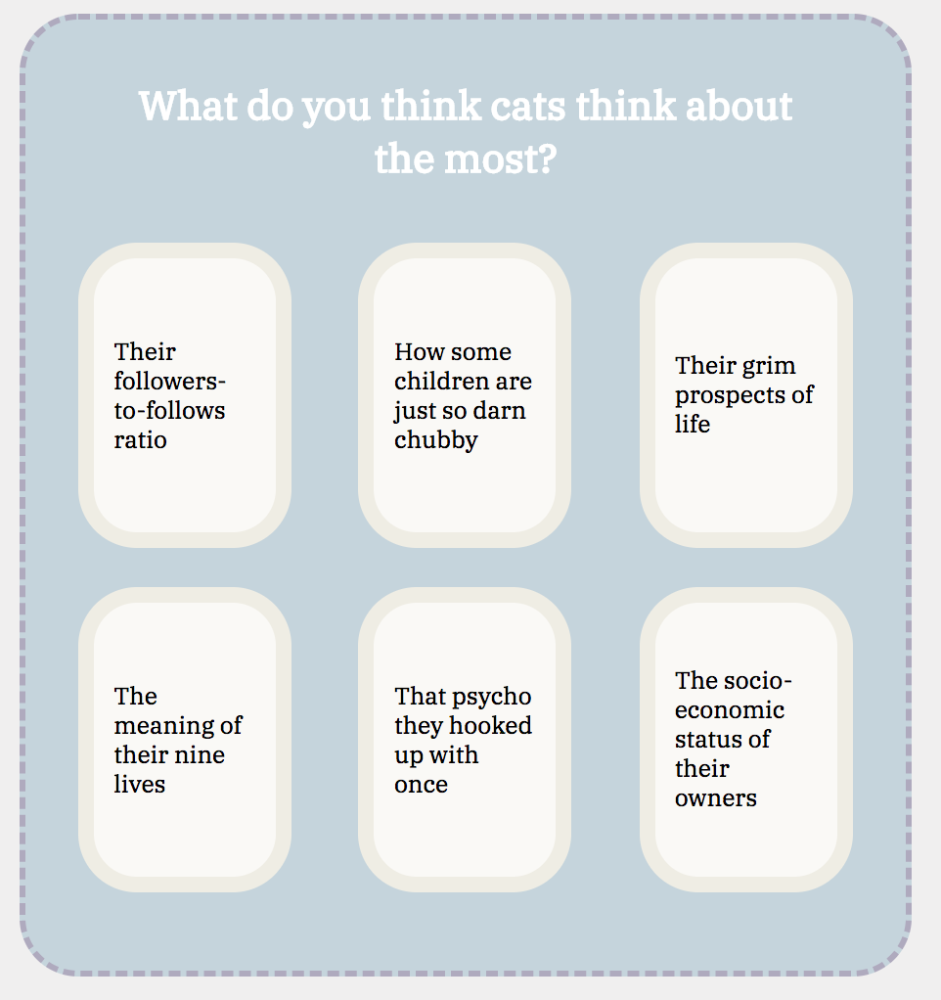

Lab 2 - Buzzfeed
Chaeyoon Kim
April 9, 2018

I created a quiz where the user answers a few questions regarding cats, and is in return
given a funny Instagram account to follow. Each question provides 6 possible answers, that each (secretly) correspond to one of the six potential outcomes. I use Javascript to count the number of selected choices for each of the six to eventually show the one with the highest score in the end. Hovering over the options creates a white halo around the option (with a transition) and selected options have a yellow halo around them whereas the unchecked options are faded out.

I struggled a lot with the Javascript commands,
but eventually I was able to get them working! I think I am still getting used to aligning
via flex boxes, so it took a while to figure some details out but it worked out in the end. I really liked playing around with the style and transitions.

Some fun details:
1) Hovering over option causes option to transition to a white halo.

2) Selecting option causes option to transition to a yellow halo while other options fade out.

3) The done button also has hover transitions and downward transitions when pressed.

4) If there are unanswered questions, an error message is sent.

5) If all requirements are met, pressing the done button causes the modal to pop up with the result.

6) Texts and images resize for narrower windows.

